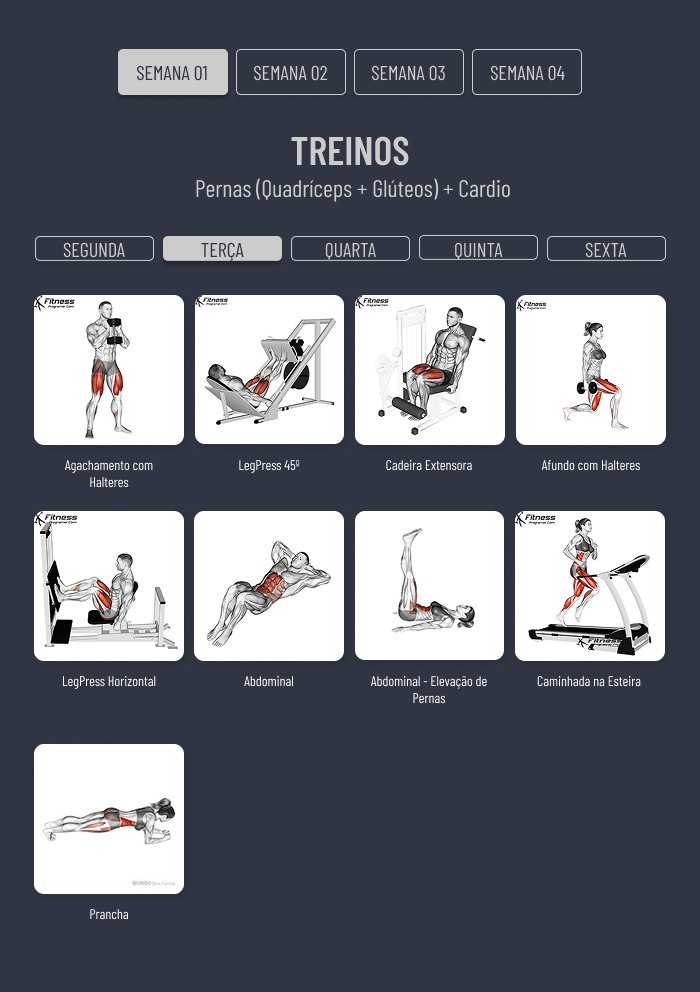
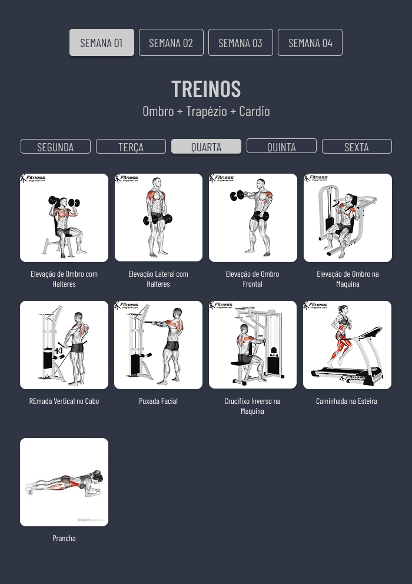
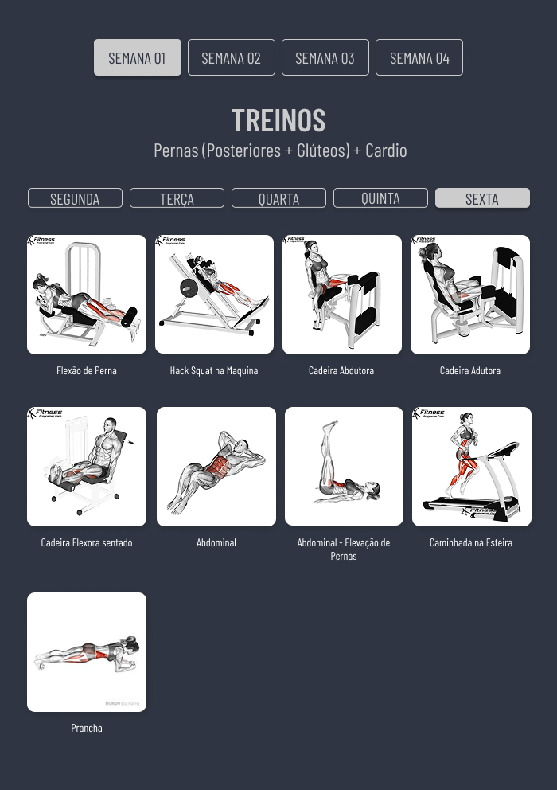
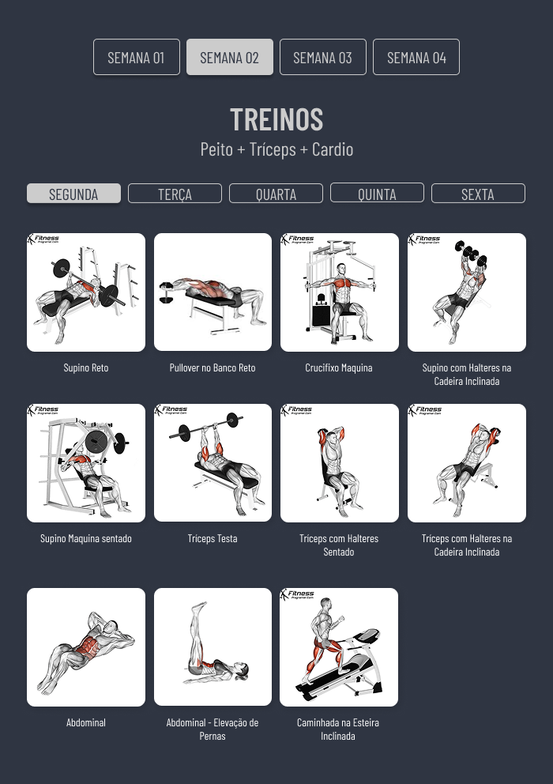
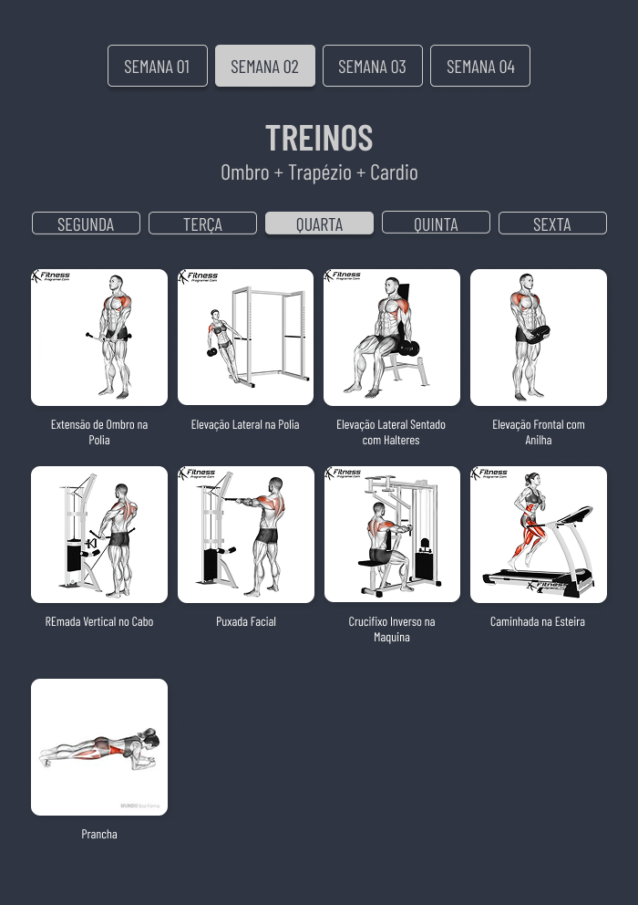
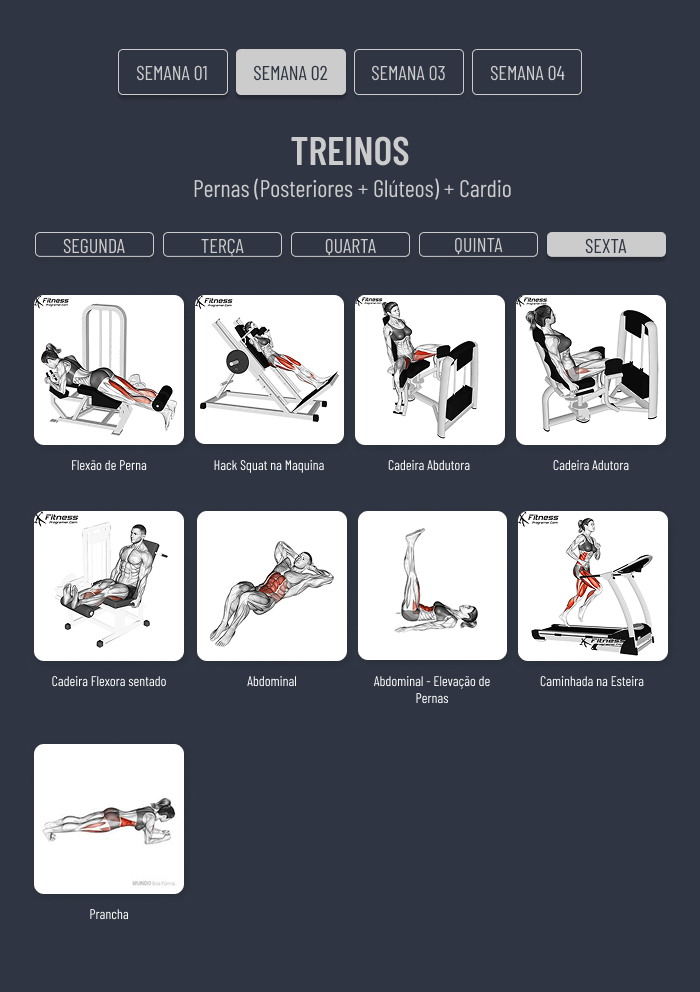

<div align="center">
  
  <h1>Anderson Toledo Martins Moreira</h1>
  <a href="http://www.atmm.dev" target="_blank">Resume Online</a> <br /> <br />
</div>

<!-- References for Create budgets :: https://shields.io/category/build -->
<div align="center">
  
  
  
</div>

## Description

This is a project made with React and Bootstrap, for Bodybuilding training, separated by weeks and days.

## Screens Layout

<div align="center">
  Week One - Monday
  
  <br /> <br /> 
  Week One - Tursday
  
  <br /> <br /> 
  Week One - Wednesday
  
  <br /> <br /> 
  Week One - Thursday
  
  <br /> <br /> 
  Week One - Friday
  
  <br /> <br />
  Week Two - Monday
  
  <br /> <br /> 
  Week Two - Tursday
  
  <br /> <br /> 
  Week Two - Wednesday
  
  <br /> <br /> 
  Week Two - Thursday
  
  <br /> <br /> 
  Week Two - Friday
  
  <br /> <br />
  
</div>

## Programming Languages and Frameworks

```bash
# Bootstrap
# React 19
# Git / Github
```

## System Requirements

```bash
# Git
# Node
```
